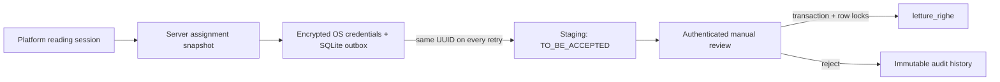

# Mobile readings architecture

## Trust boundaries

The assignment downloaded from the API is a signed-in operator's working copy,
not authority to alter platform relationships. Each item contains an immutable
server-generated context hash derived from the session, condominium, utility,
and meter serial. The server recalculates and compares that context both when a
submission arrives and again when a reviewer accepts it.

## Duplicate and corruption defenses

- A submission UUID is generated on the device and never changed during retry.
- The server stores a canonical payload SHA-256. The same UUID and same payload
  is an idempotent success; the same UUID with different data is a conflict.
- After the first upload attempt, the app treats a capture as immutable even if
  the response was lost. This avoids changing data the server may already hold.
- A local unique constraint permits only one active capture per assignment item.
- A separate server check flags two candidate submissions for the same item.
- Final acceptance locks both candidate and target rows in one transaction.
- The existing unique key on `(id_sessione, id_utenza)` is the final concurrent
  duplicate guard. Replacing a reading requires an explicit reviewer action.
- Every workflow transition is appended to `mobile_reading_submission_events`.

## Offline behavior

SQLite runs in WAL mode and contains assignment snapshots, captures, and the
outbox. Synchronization is single-flight and safe to invoke on app foreground,
on a timer, or manually. Failures use bounded exponential backoff. A `401`
requires login again but deliberately does not erase pending work. Logout is
blocked while unsynchronized readings remain.

All local queries and outbox operations are scoped to the authenticated operator
ID. On a shared device, signing into another account cannot display or upload the
previous operator's assignments. Legacy local snapshots are migrated in place
and remain hidden if their owner cannot be recovered.

The operating system may suspend a mobile app, so timer-based sync is only a
convenience. The durable outbox is the fallback: every foreground launch and
manual sync resumes pending work.

## Photo handling

The device sends the reading envelope first, including the expected photo
SHA-256, then uploads the image. The item remains `UPLOAD_INCOMPLETE` until the
matching JPEG, PNG, or WebP arrives. Local fallback files live outside all
public Express directories. R2 objects are private and use deterministic keys.
Only an authenticated `ADMIN` or `REVIEWER` endpoint returns an image.

Camera capture and on-device numeric recognition are intentionally separated
from transport. The next slice will add ML Kit-based recognition, always display
the recognized value, and require the operator to confirm or correct it before
the immutable capture is queued.

## Operational rules

- Create named accounts for each operator; do not share the administrator login.
- Use HTTPS for every non-local API connection.
- Back up MySQL and private photo storage together.
- Do not remove staging/event rows as part of normal cleanup; they are the audit
  record for how a reading reached the final table.
- Apply migrations before deploying an API version that references them.
